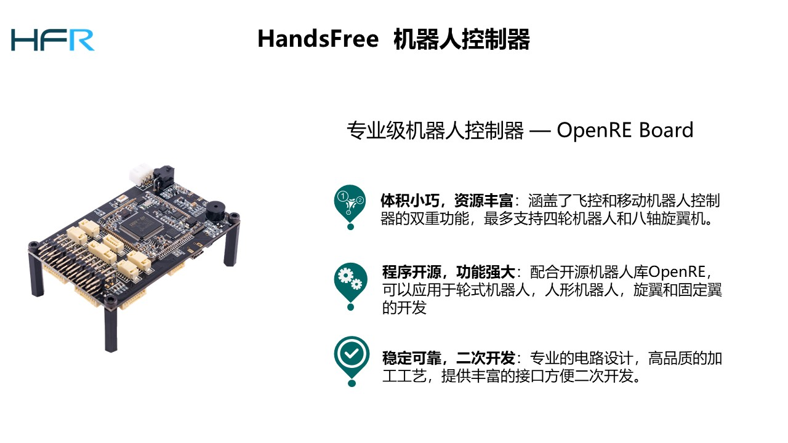
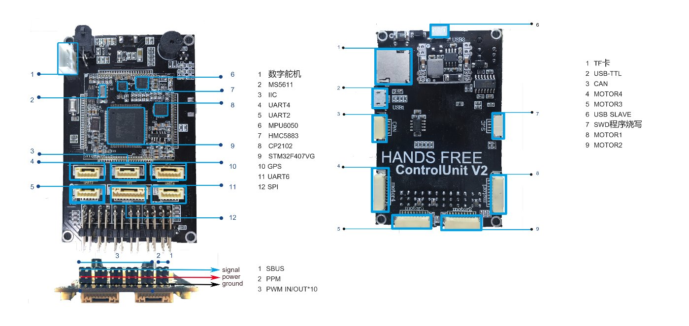
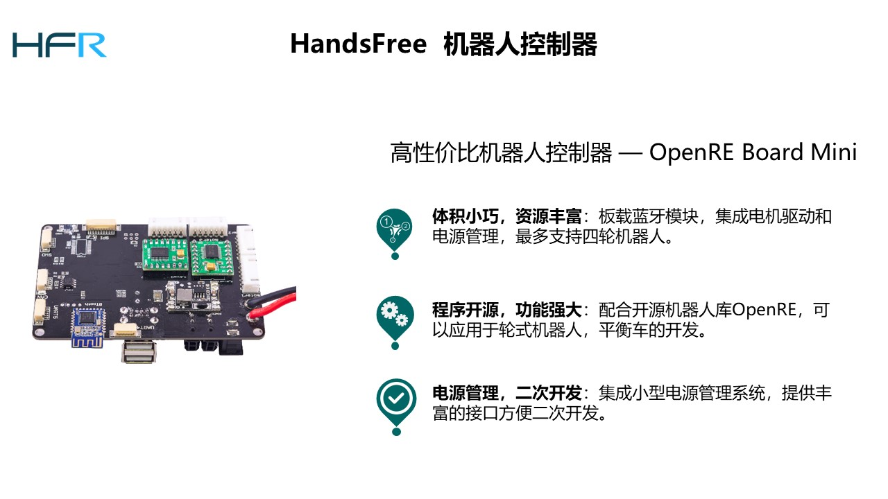
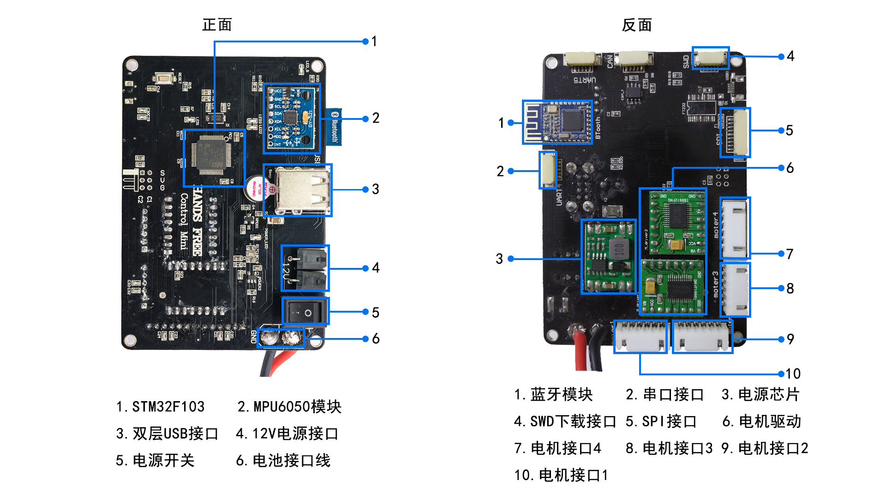

# OpenRE -- The Open Source Robot Embedded Library 
## keywords: moblile robotics , STM32 , c++ , makefiles , ROS 

------------------------------------------------------------------------------
## Description

This is a C++ embedded library for robotics base on STM32 and intended to provide GNU Makefiles.    

### [OpenRE Tutorial](http://wiki.hfreetech.org/docs/OpenRE/)
    
###  Community: 
* [HandsFree Github](https://github.com/HANDS-FREE)   
* [HandsFree Website](http://www.zonewander.com/)   
* [HandsFree Wiki](http://wiki.hfreetech.org/) ,  [Old Version Wiki](http://wiki.handsfree.org.cn/)  
* Email: hands_free@126.com   

###  Folder structure
- ├── **0_Project**   ----  some demos base on this library  
- │   ├── examples   ----   stm32fxx examples project of openre
- │   ├── firmware  ----  firmware projects of handsfree robots
- │   ├── etc..
- ├── **1_Processor**   --- the board-level abstraction layer ,   support handsfree countrol_unit_v1 , countrol_unit_v2, countrol_unit_mini , stm32f407_discovery     
- │   ├── BoardAbstract
- │   ├── board.mk
- │   ├── Interrupt
- │   ├── STM32F1
- │   └── STM32F4
- │   ├── etc..
- ├── **2_Package**  ----  this dir include many tool packs . you can use it for moblile robotics, fly control etc..    
- │   ├── common
- │   ├── robolink
- │   ├── imu
- │   ├── motor
- │   ├── robot_abstract
- │   ├── robot_control
- │   ├── tf
- │   ├── etc..
- ├── **3_OS**  : OpenRE support RTOS(ucosII ucosIII nuttx), GUI(STEMWIN) , FATFS   
- ├── **4_Thirdparty**
- │   ├── Dobot 
- │   ├── Eigen3
 -│   ├── libs_include.h
- │   ├── Matrix
- │   └── thirdparty.mk
- ├── **5_Development_Toolchain**
- ├── **6_Tools**
- │   ├── env_config.sh
- │   ├── swd_upload.sh
- │   ├── tarall.sh
- │   └── tar.sh
- ├── **7_Documentation**
- ├── clean_build_linux.sh
- ├── clean_build_win.bat
- ├── HANDS_FREE_OpenRE_F1.pro
- ├── HANDS_FREE_OpenRE_F4.pro
- └── README.md

---

## Installation
### Resources   
  * Download the latest openre code:      
 
 git clone https://github.com/HANDS-FREE/OpenRE      

### OpenRE Toolchain      
   
#### Method1:  source installation (recommended) 

```
$ cd OpenRE & git clone git@github.com:HANDS-FREE/5_Development_Toolchain.git    
$ cd 5_Development_Toolchain    
$ sh auto_set_openre.sh   
```

#### Method2:  installation by deb 
 
```
$ sudo apt-get install software-properties-common python-software-properties 
$ sudo add-apt-repository ppa:terry.guo/gcc-arm-embedded    
$ sudo apt-get update   
$ sudo apt-get install openocd  gcc-arm-none-eabi    
$ sudo usermod -a -G dialout $USER    
$ sudo apt-get install lib32ncurses5 libtool libusb-1.0 libftdi-dev python python-serial python-empy libpython2.7:i386    
$ sudo apt-get remove modemmanager    
```

---

## Usage and Examples

### A Simple Demo 
    * Led toggle:     
            cd 0_Project/examples/handsfree_simple_app/linux    
            
 **check the makefile config matching your main control board**      
             
            make clean
            make    
            make burn   

### Robot Firmware

            cd 0_Project/firmware/handsfree_wheel_robot/linux

 **check the makefile config  matching your main control board**      
             
            make clean
            make
            make burn

 **Tips**: Lots of examples are provided in folder 0_Project and you can get some manuals in folder 7_Documentation.

---

## OpenRE Board

OpenRE Board is a motion controller developed according to the hardware standard of the HandsFree open source project. It is an important part of all HandsFree Robot platforms.It can be applied to the development of wheeled robots, humanoid robots, balance vehicles, and drones.**More importantly**, OpenRE Board is the official standard platform for the OpenRE(Open Source Robot Embedded Library).

We are now sharing two different performance openre boards : OpenRE Board Mini,OpenRE Board V2

### OpenRE Board V2

[BUY OpenRE Board](https://item.taobao.com/item.htm?spm=a1z10.1-c-s.w4004-13256568658.6.75a944b8JqilvB&id=540531985871)




### OpenRE Board Mini




## License

OpenRE is licensed generally under a permissive 3-clause BSD license. Contributions are required to be made under the same license.            
            
## Contact    

If you have any problem, or you have some suggestions for this code, please contact WenKe Ma by 315261982@qq.com, thank you very much!  
